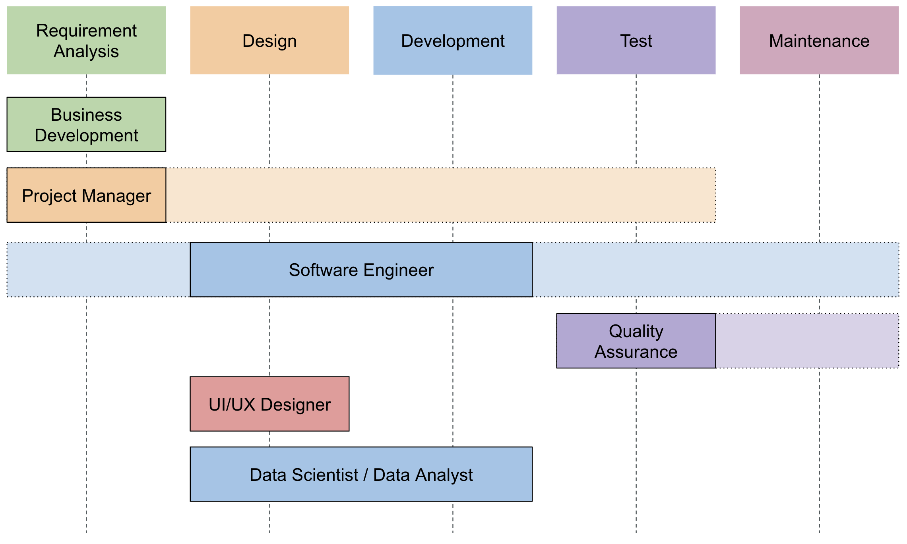

# Lulus IF, Jadi Apa?

## Introduction

Pada Minggu, 11 April 2021, [M. Syah Royni](https://github.com/syahroyni) (IF2011) dan [Arief Rahmansyah](https://github.com/ariefrahmansyah) (IF2011) memberikan webinar berjudul _Step Up After Graduation_. Tujuan dari webinar ini adalah memberikan gambaran mengenai posisi-posisi karir yang ada di perusahaan IT serta menjelaskan _job description_ masing-masing posisi pada siklus hidup pengembangan perangkat lunak ([_Software Development Life Cycle_](https://en.wikipedia.org/wiki/Systems_development_life_cycle)).

Links:
1. [Slide presentasi](https://docs.google.com/presentation/d/1C6Zfu8kpDPwA0X2GBjbF2P-B2LwnMpLe1kUUNtjByo0/edit?usp=sharing)
2. Video webinar (_To be updated_)

## Software Development Life Cycle (SDLC)

SDLC adalah proses yang digunakan oleh organisasi untuk merancang, membangun, dan menguji perangkat lunak berkualitas tinggi yang memenuhi kebutuhan bisnis dan pengguna. SDLC terdiri dari beberapa tahapan yaitu _requirements analysis_, _design_, _development_, _testing_, dan _maintenance_. Setiap tahapan memerlukan minimal satu bidang profesi, misalnya Project Manager dan Software Engineer dibutuhkan pada tahap _requirement analysis_.

## Posisi Karir di Industri IT

### Business Development

Business Development responsibles for the creation of long-term value for an organization from customers, products, markets, and relationships. Business Development is researching new products and where they will fit into a new market.

#### What are BD doing?
1. Market research
2. Product research
3. Develop business strategy with other divisions
4. Build and nurture customer relationship

#### Skills needed

Data analytics, Management, Communication, Marketing, Negotiation

#### Mata kuliah "wajib"
1. Kewirausahaan dan manajemen bisnis
2. Technopreneurship
3. Metodologi penelitian

### Project Manager

A Project Manager is responsible for planning, overseeing and leading projects from ideation through to completion.

#### What are PM doing?
1. Managing project progress and ensuring project meets deadlines
2. Coordinating staff and managing large and diverse teams
3. Managing relationships with clients and stakeholders

#### Skills needed

Management, Communication, Leadership, Analytics, Problem solving

#### Mata kuliah "wajib"
1. Rekayasa perangkat lunak
2. Manajemen proyek perangkat lunak
3. Jaminan kualitas perangkat lunak
4. Kewirausahaan dan manajemen bisnis

### Software Engineer

A person who applies the principles of software engineering to the SDLC. Bisa dibilang, Software engineer tuh bakalan in-charge di hampir semua proses SDLC 🤓

#### What are SE doing?
1. Analyse user requirements
2. Design technical specification document
3. Build software; write and test code
4. Test software (sometimes together with QA)
5. Maintain software from bugs and errors

#### Skills needed

Software Engineering, Communication, Analytics, Problem solving

#### Mata kuliah "wajib"
1. Algoritma dan Pemrograman; Struktur Data; OOP; Basis Data
2. Web programming, Mobile computing programming
3. RPL, MPPL, OOAD, JKPL
4. Well, hampir semua matkul di IF :))

### Quality Assurance

The team that verify the product that already built fulfill all the product requirement.

#### What are QA doing?
1. Make the test case
2. Test and make sure the quality of the product that already built by the test case
3. Some company already use automation testing. So there is QA Engineer that build the automation test tool.

#### Skills needed

Communication, Analytics and problem solving, Details-oriented

#### Mata kuliah "wajib"
1. Algoritma dan Pemrograman; Struktur Data; OOP; Basis Data
2. Rekayasa perangkat lunak
3. Manajemen proyek perangkat lunak
4. Jaminan kualitas perangkat lunak

### Data Scientist

A data scientist is someone who makes value out of data. Such a person proactively fetches information from various sources and analyzes it for better understanding about how the business performs, and to build AI tools that automate certain processes within the company.

#### What are DS doing?
1. Build high quality ML products to be integrated with products
2. Discover the information hidden in vast amounts of data
3. Help company make data-driven decisions that can drive business value

#### Skills needed

Data analytics, AI, ML, Mathematics, Statistics, Programming, SQL, Data visualization tools

#### Mata kuliah "wajib"
1. Kalkulus, Probabilitas dan Statistika, Matriks dan Vektor
2. Artificial Intelligence, Machine Learning, Jaringan Syaraf Tiruan, NLP, Fuzzy System, Sistem Pakar, Sistem Pendukung Keputusan, Temu Kembali Informasi
3. Basis Data, Data Mining

### Data Analyst

Data Analyst bertanggung jawab dalam menerjemahkan angka-angka menjadi laporan yang dapat dengan mudah dimengerti oleh manajemen. Setiap bisnis mengumpulkan data, baik data penjualan, riset pasar, logistik, atau biaya transportasi. Pekerjaan seorang Data Analyst adalah mendapatkan dan menggunakan data tersebut untuk membantu perusahaan membuat keputusan bisnis yang lebih baik.

#### What are DA doing?
1. Discover the information hidden in vast amounts of data
2. Help company make data-driven decisions that can drive business value

#### Skills needed

Data analytics, Mathematics, Statistics, Programming, SQL, Data visualization tools

#### Mata kuliah "wajib"
1. Kalkulus, Probabilitas dan Statistika, Matriks dan Vektor
2. Algoritma dan Pemrograman
3. Basis Data, Data Mining

### UI/UX Designer

UI/UX Designer designs all the product needs to give the best experience and engage user.

#### What are UI/UX Designer doing?
1. Design everything to give user the best experience using the app
2. Research the user experience (Survey, interview, etc)
3. Make Design System (collaborate with Software Engineer)

#### Skills needed

Communication, Visual Communication, Problem solving

#### Mata kuliah "wajib"
1. Interaksi Manusia Komputer
2. Pemrogaman Web
3. Pemrogaman Komputasi Bergerak
4. Visual Communication Design (External Study)
5. Psychology (External Study)
